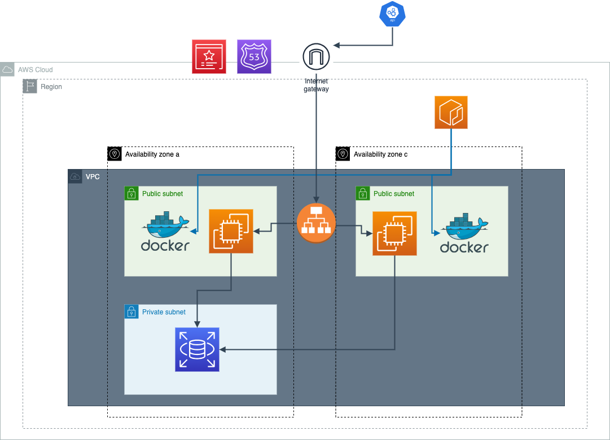

# Real World API Documents

## realworld-infrastructur

## URL

### [realworld](https://safetykayak.com)  
※ ドメインがsaftykayak.comとなっていますがオリプロ用に取得したものになります。

## インフラ図
[インフラ構成図](./documents/infrastructure.drawio)

---

## API
## Articles
### GET /api/articles
- 説明: すべての記事を取得します。
- パラメータ: なし
- レスポンス: 記事のリスト

### GET /api/articles/feed
- 説明: フィード形式で記事を取得します。
- パラメータ: なし
- レスポンス: フィード形式の記事のリスト

### POST /api/articles
- 説明: 新しい記事を作成します。
- パラメータ: 記事のデータ（タイトル、本文など）
- レスポンス: 作成された記事のデータ

### PUT /api/articles/:id
- 説明: 指定されたIDの記事を更新します。
- パラメータ: 更新する記事のデータ
- レスポンス: 更新された記事のデータ

### DELETE /api/articles/:id
- 説明: 指定されたIDの記事を削除します。
- パラメータ: なし
- レスポンス: 削除の確認

## Users
### POST /api/users
- 説明: 新しいユーザーを登録します。
- パラメータ: ユーザー情報（名前、メールアドレス、パスワードなど）
- レスポンス: 登録されたユーザーの情報

### POST /api/users/login
- 説明: ユーザーがログインします。
- パラメータ: ユーザーの認証情報（メールアドレス、パスワード）
- レスポンス: 認証成功の確認とユーザー情報

